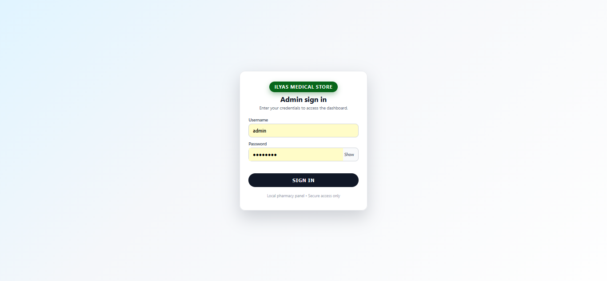
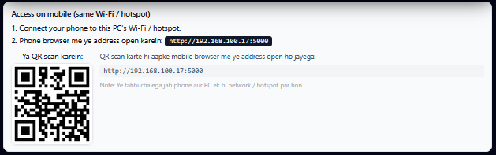
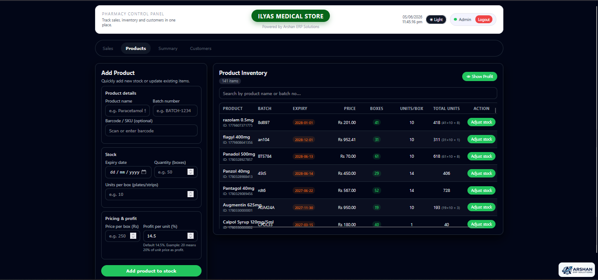
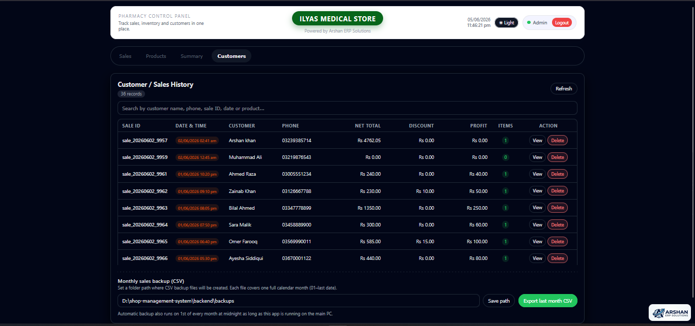
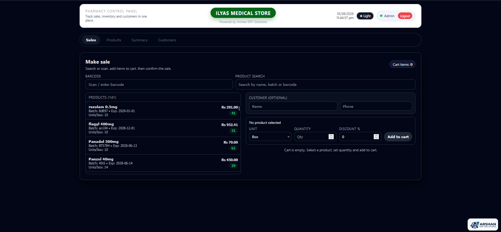
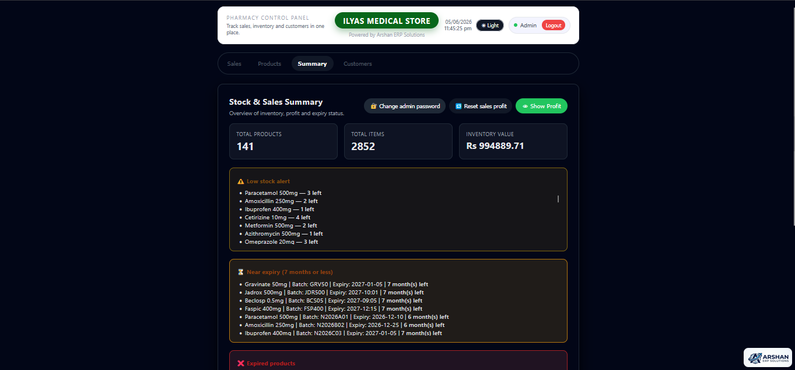
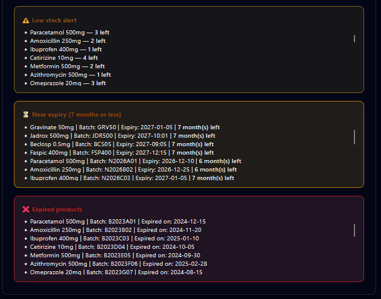
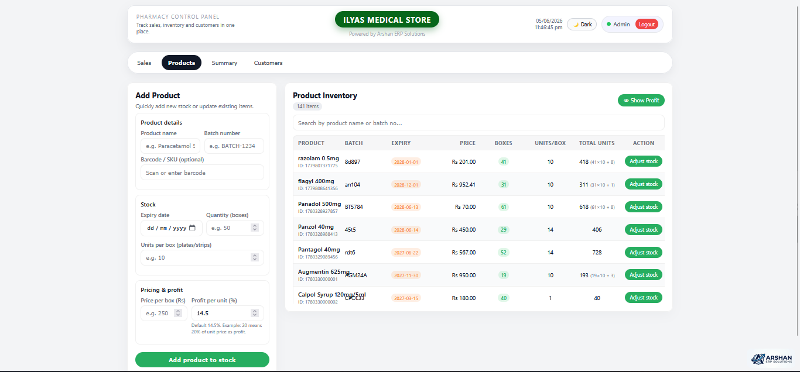

# Pharmacy POS System

A lightweight Point of Sale (POS) and inventory management system designed for small medical stores and retail businesses.  
This project focuses on fast billing, simple stock control, and thermal receipt printing for 80mm printers.

> If you need a full installation manual, setup support, or customization, please contact me directly (details below).

---

## 📸 System UI Overview

Below are real screenshots of the system showing main features and workflow:

---

### 🔐 Login Page

Secure login system to restrict unauthorized access.  
Supports role-based entry for admin/staff users.

---

### 📊 Dashboard (Main Overview)

Central control panel showing overall business stats.  
Quick access to sales, stock, and alerts from one screen.

---

### 📦 Add Product & Product List

Manage inventory efficiently:
- Add new medicines/products
- View complete product list
- Track available stock in real time

---

### 👤 Customer Details

Stores customer information for every sale:
- Name & phone tracking
- Purchase history support
- Useful for repeat customers

---

### 🛒 Make Sale (Billing System)

Fast billing system designed for medical stores:
- Instant product search
- Box / strip / unit selling
- Auto total calculation
- Discount handling per item

---

### 📉 Stock Summary

Complete stock overview:
- Available stock tracking
- Inventory valuation
- Helps in purchase planning

---

### ⚠️ Low Stock & Expiry Alerts

Smart alert system:
- Low stock notifications
- Expiry tracking for medicines
- Prevents inventory loss

---

### 🎨 Light Theme UI

Clean and modern light UI design:
- Easy on eyes for long use
- Optimized for desktop + mobile screens

---

## ⚡ Features

- Fast product search by name, batch number, or barcode
- Box / unit (plate) based selling with proper stock validation
- Per-item discount handling and net total calculation
- Profit calculation per sale and per item
- Customer details capture (name, phone) for each sale
- 80mm thermal receipt printing support:
  - Clean header layout
  - Compact item table
  - Proper alignment for thermal printers
- Mobile-friendly responsive UI
- Toast notifications for success & error handling

---

## 🧰 Tech Stack

- **Frontend:** React (functional components, hooks)
- **Styling:** Custom CSS / POS-style UI design
- **State Management:** React `useState` / `useEffect`
- **Printing:** Browser print with `@media print` optimization
- **Backend API:** REST-based structure (customizable)

---

## 📌 Project Status

This project is actively developed and used as a real-world POS solution for medical stores.  
New features and improvements are continuously added based on real usage feedback.

---

## 🚀 Installation & Setup

A full installation guide is available on request.

You can contact for:

- Full system installation
- Database / backend integration
- Custom feature development
- UI/UX modifications

---

## 📞 Contact & Support

**Arshan ERP Solutions**  
**Name:** Muhammad Arshan  
📱 WhatsApp / Phone: `+92 323 9385714`  
📧 Email: `Khanarshan750@gmail.com`

You can also open an Issue on this repository for bugs or feature requests.

---

## 📄 License

This project is shared for learning and evaluation purposes.  
For commercial deployment or business use, please contact **Arshan ERP Solutions**.
